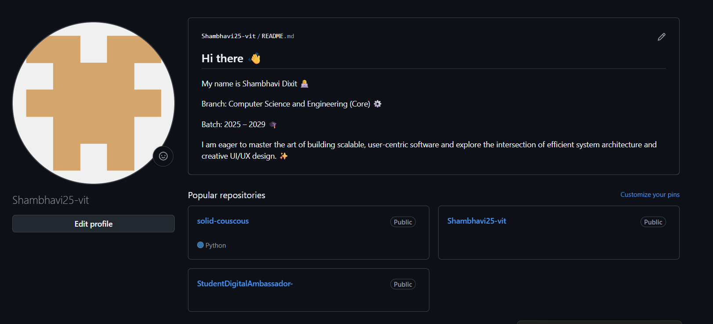
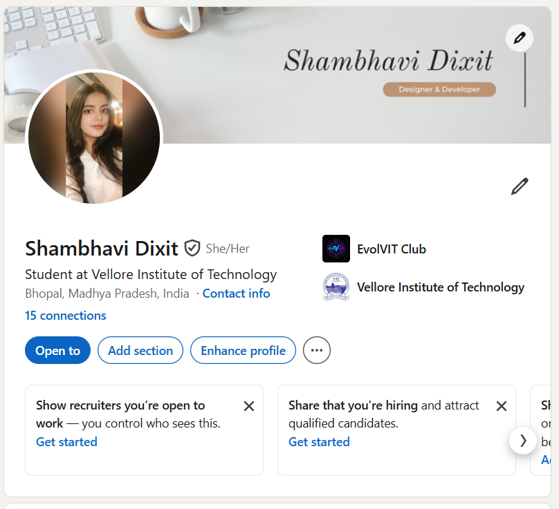
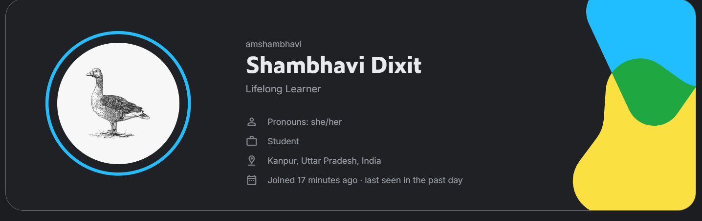

# Task 2: Student Digital Portfolio Reflection 🚀

A curated overview of my professional digital footprint and technical contributions across key platforms.

---

## 💻 GitHub: The Technical Headquarters
> *Where code meets creativity. This serves as the central hub for my open-source contributions, academic projects, and technical experimentation.*

* **Focus:** UI/UX Design implementations, Python development, and Cloud Computing architecture.
* **Key Highlights:** Active participation in community-driven projects and maintaining organized documentation.

---

## 🌐 LinkedIn: The Professional Network
> *My digital bridge to the industry. Used for networking with mentors, sharing insights from my design journey, and tracking professional milestones.*

* **Focus:** Personal branding, professional storytelling, and industry engagement.
* **Key Highlights:** Showcasing certifications and building a network within the tech and design ecosystem.

---

## 📊 Kaggle: The Data Science Playground
> *The arena for data exploration. This platform reflects my growing interest in data analysis and competitive problem-solving.*

* **Focus:** Machine Learning datasets, data visualization, and notebook optimization.
* **Key Highlights:** Engaging with real-world datasets to sharpen analytical thinking.

---

[⬅️ Back to Task 1](task-1-presentation)
