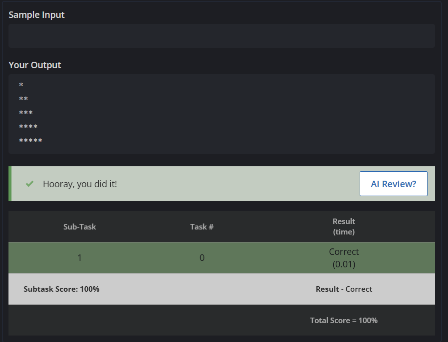
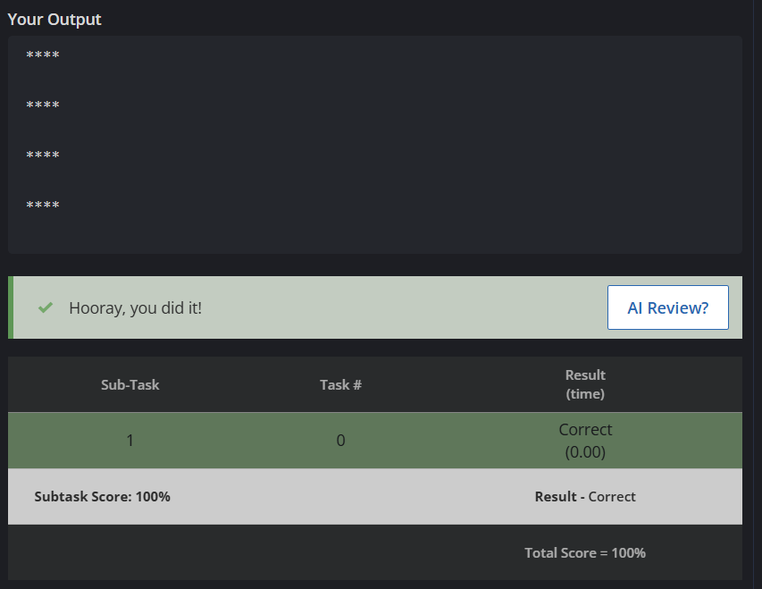
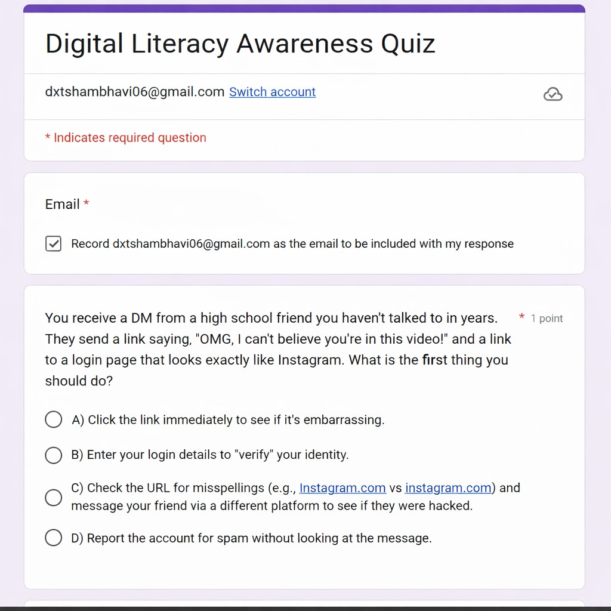
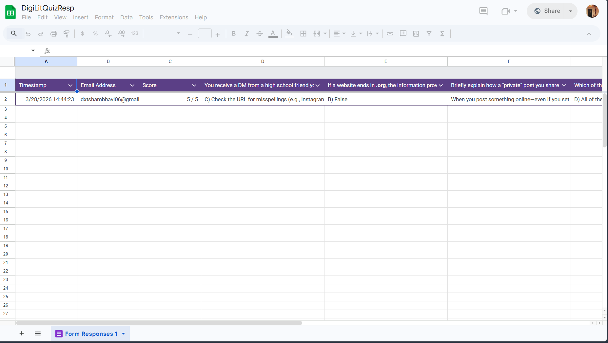

# Task 3: Coding & Collaboration Platforms Activity Log 📝

## 🐍 Part A: Coding Practice (CodeChef)
I successfully completed Python-based pattern printing challenges on **CodeChef** to demonstrate fundamental programming logic, nested loop structures, and debugging skills.

### 💡 Challenges Solved:
1. **Right-Angled Triangle Pattern** 📐  
   Utilized nested loops to manage row and column character manipulation for dynamic sizing.
   

2. **Square Star Pattern** 🔳  
   Practiced algorithmic thinking to maintain consistent character output across a 2D grid.
   

---

## 🤝 Part B: Google Workspace Collaboration
As a **Student Digital Ambassador**, I designed and distributed a **Digital Literacy Awareness Quiz** to engage with my peers and promote safer online habits.

### 📋 Quiz Details:
* **Platform:** Google Forms integrated with Google Sheets for real-time data analysis. 📊
* **Structure:** The quiz consists of 5 targeted questions, featuring both multiple-choice and short-answer formats.
* **🔗 [Access the Live Quiz](https://docs.google.com/forms/d/e/1FAIpQLSdHA3yRE2btXlxBrOOx1F07QInKN529zHOP9NQxWq2bkD9nZw/viewform?usp=publish-editor)**
  

### 📈 Insights & Impact:
* **Goal:** To collect data on current digital literacy trends and evaluate the awareness levels within my batch.
* **🔗 [View Response Data (Google Sheets)](https://docs.google.com/spreadsheets/d/10462eluWstV6hqcyN1CvQoMMYnFahFOmJD0-AfDAVn4/edit?usp=sharing)**
  

---
